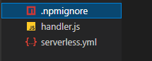

# Serverless FrameWork - lambda를 중점으로

- - -
serverLess를 aws webSite에서 gui 환경으로 조작하지 않고
vscode같은 개발 툴에서 작업할 수 있는 serverless framwork 사용법에 대하 알아보자.
- - -

<details>
  <summary>설치방법</summary>
   
   1. serverless 설치 
      - npm i g serverless
   2. 작업 폴더 생성 후
      - serverless create --template aws-nodejs
   3. 완료되면 3가지 파일이 생성된다.
      - 
</details>

설치 후에는 배포를 위해 aws 인증을 거친다.

<details>
  <summary>인증</summary>
  terminal에서 아래 명령어로 인증한다.

  ```javascript
    serverless config credentials --provider aws --key mykey --secret myseretkey
  ```
</details>


<details>
  <summary>코드 수정</summary>
  만들어진 js 파일을 수정한다.
  
  ```javascript
  "use strict";

module.exports.hello = async (event) => {
  return {
    statusCode: 200,
    body: JSON.stringify(
      {
        message: "Go Serverless v1.0! Your function executed successfully!",
        input: event,
      },
      null,
      2
    ),
  };
   return { message: 'Go Serverless v1.0! Your function executed successfully!', event };
};
  ```
</details>


<details>
  <summary>테스트</summary>
  테스트 명령어 

  ```javascript
   serverless invoke -f hello
  ```
</details>


<details>
  <summary>배포</summary>
  yml 파일수정 -> 화살표 표시를 잘 수정한다.

 ```yml
    # Welcome to Serverless!
    #
    # This file is the main config file for your service.
    # It's very minimal at this point and uses default values.
    # You can always add more config options for more control.
    # We've included some commented out config examples here.
    # Just uncomment any of them to get that config option.
    #
    # For full config options, check the docs:
    #    docs.serverless.com
    #
    # Happy Coding!

    service: sw  -> 이게 람다의 이름이 된다.
    # app and org for use with dashboard.serverless.com
    #app: your-app-name
    #org: your-org-name

    # You can pin your service to only deploy with a specific Serverless version
    # Check out our docs for more details
    frameworkVersion: '2'

    provider:
      name: aws
      runtime: nodejs12.x
      lambdaHashingVersion: 20201221

    # you can overwrite defaults here
      stage: dev
      region: ap-northeast-2 -> region을 적어줘야한다 default는 north-est 인거같다.

    # you can add statements to the Lambda function's IAM Role here
    #  iamRoleStatements:
    #    - Effect: "Allow"
    #      Action:
    #        - "s3:ListBucket"
    #      Resource: { "Fn::Join" : ["", ["arn:aws:s3:::", { "Ref" : "ServerlessDeploymentBucket" } ] ]  }
    #    - Effect: "Allow"
    #      Action:
    #        - "s3:PutObject"
    #      Resource:
    #        Fn::Join:
    #          - ""
    #          - - "arn:aws:s3:::"
    #            - "Ref" : "ServerlessDeploymentBucket"
    #            - "/*"

    # you can define service wide environment variables here
    #  environment:
    #    variable1: value1

    # you can add packaging information here
    #package:
    #  patterns:
    #    - '!exclude-me.js'
    #    - '!exclude-me-dir/**'
    #    - include-me.js
    #    - include-me-dir/**

    functions:
      hello:
        handler: handler.hello -> 함수이름이다.
          events:
            - httpApi: // api gateway와 자동 연결된다.
                path: /users/create
                method: get

      -> 함수를 여러개 생성할 경우
      hello2:
        handler: /func/handler.hello2 -> 함수이름이다. (경로)
          events:
            - httpApi: // api gateway와 자동 연결된다.
                path: /users/create
                method: get

    #      - websocket: $connect
    #      - s3: ${env:BUCKET}
    #      - schedule: rate(10 minutes)
    #      - sns: greeter-topic
    #      - stream: arn:aws:dynamodb:region:XXXXXX:table/foo/stream/1970-01-01T00:00:00.000
    #      - alexaSkill: amzn1.ask.skill.xx-xx-xx-xx
    #      - alexaSmartHome: amzn1.ask.skill.xx-xx-xx-xx
    #      - iot:
    #          sql: "SELECT * FROM 'some_topic'"
    #      - cloudwatchEvent:
    #          event:
    #            source:
    #              - "aws.ec2"
    #            detail-type:
    #              - "EC2 Instance State-change Notification"
    #            detail:
    #              state:
    #                - pending
    #      - cloudwatchLog: '/aws/lambda/hello'
    #      - cognitoUserPool:
    #          pool: MyUserPool
    #          trigger: PreSignUp
    #      - alb:
    #          listenerArn: arn:aws:elasticloadbalancing:us-east-1:XXXXXX:listener/app/my-load-balancer/50dc6c495c0c9188/
    #          priority: 1
    #          conditions:
    #            host: example.com
    #            path: /hello

    #    Define function environment variables here
    #    environment:
    #      variable2: value2

    # you can add CloudFormation resource templates here
    #resources:
    #  Resources:
    #    NewResource:
    #      Type: AWS::S3::Bucket
    #      Properties:
    #        BucketName: my-new-bucket
    #  Outputs:
    #     NewOutput:
    #       Description: "Description for the output"
    #       Value: "Some output value"
  ```

  
  배포 명령어 
  ```javascript
   serverless deploy
  ```
</details>

