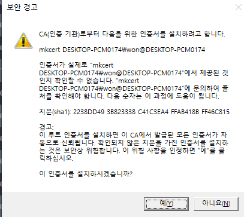

# localhost에서 자체 https 인증서를 만들때

- - -
특이한 경우이긴 하지만 https를 localhost에 적용시킬 때가 있다.
그리고 https가 적용이 되긴하지만 주의 요함이라고 뜨는 것도 벗어나고 싶을 때
자물쇠가 초록인걸 보고싶을 때 ... 사용한다.
- - -

window
------

1. 관리자권한 powershell 실행

2. https://chocolatey.org/install 로 들어가서 command 명령어를 복붙한다.

3. choco install mkcert 실행

4. 관리자 권한으로 cmd에서 원하는 폴더로 들어가 mkcert -install 
 - 그럼 아래와 같은 이미지나오고 예를 클릭

    

5. mkcert example.com "*.example.com" example.test localhost 127.0.0.1 ::1
 - 인증서가 설치될 호스트를 지정하는 것 같다.

6. nodejs 코드
```javascript
const server = https.createServer(
    {
      key: fs.readFileSync('./keys/example.com+5-key.pem'),
      cert: fs.readFileSync('./keys/example.com+5.pem')
    },
    app
  );
```