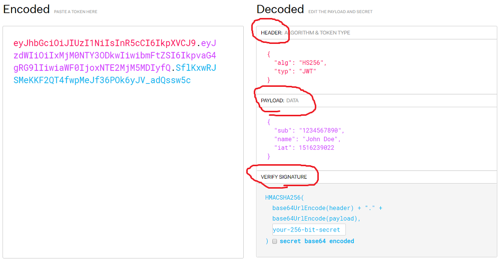

# Node.js에서 jwt 사용하기

1. JSON Web Token의 약자로, 일반적으로 HTTP API 서버를 만들 때에 인증 방법으로 사용한다.
2. 서버는 사용자가 로그인 할 때 고유한 Token을 생성합니다.
3. 생성한 토큰을 Client에 전달한 후,
4. 앞으로의 올바르 사용자 인증은 생성된 Token을 사용해서 판별합니다.

---q

## 1. 기본 구조


<https://jwt.io/>

- jwt는 기본적으로 세가지로 구성되고 구분됩니다.

1. Header : 암호화 알고리즘
2. PlayLoad : 넣을 데이터s
3. Verify Signature : 위조방지를 위한 암호

## 2. Install & require

```javascripts
  npm install jsonwebtoken
  const jwt = require('jsonwebtoken');
```

- npm 으로 install 후에 requrie로 사용합니다.

## 3. Token 생성 (sign 함수)

```javascript
// info
let playload = { id: "입력값" }; // playload: 토큰의 내용
const secret = require("../secret"); // Verify Signature: 해싱할 수 있는 비밀번호
let signOptions = {
  // Sign option: 유효시간 및 암호화 등
  expiresIn: "12h", // 유효시간
  algorithm: "RS256", // 암호화 종류 설정안하면 default base64 적용
};
// Token!
let token = jwt.sign(playload, secret, signOptions);
```

- Token을 생성하기 위해 sign 함수를 사용하게 됩니다.
- playload, secret, options를 적용합니다.
- secret은 해싱할 때 필요하며 보안이 필요하기에 따로 보관하고 꺼내오는 처리를 해야합니다.

## 4. Verify Signature

```javascript
  // secret.js 파일 생성 또는 env 등
  module exports = 'secret_key' // 원하는 것으로!
```

- export 된 키를 jwt sign함수를 사용하는 곳에 require로 사용하게 됩니다.

## 5. 해싱 (verify 함수)

```javascript
let verifyOptions = {
  expiresIn: "12h",
  algorithm: ["RS256"],
};
let hasing = jwt.verify(token, secret, verifyOptions);
```

- 올바른 토큰의 내용을 보고 검증을 하기 위해서 verify 함수를 이용합니다.
- 첫 번째 인자엔 만들어 놓은 토큰
- 두 번째 인자엔 secret 키
- 세 번째는 옵션입니다.

## 6. Full code

```javascript
// 생성시
const jwt = require("jsonwebtoken");
const secret = require("../secrete");

let playload = { id: "입력값" }; // playload: 토큰의 내용
const secret = require("../secret"); // Verify Signature: 해싱할 수 있는 비밀번호
let signOptions = {
  // Sign option: 유효시간 및 암호화 등
  expiresIn: "12h", // 유효시간
  algorithm: "RS256", // 암호화 종류 설정안하면 default base64 적용
};
let token = jwt.sign(playload, secret, signOptions);

// 해싱시
let verifyOptions = {
  expiresIn: "12h",
  algorithm: ["RS256"],
};
let hasing = jwt.verify(token, secret, verifyOptions);
```
